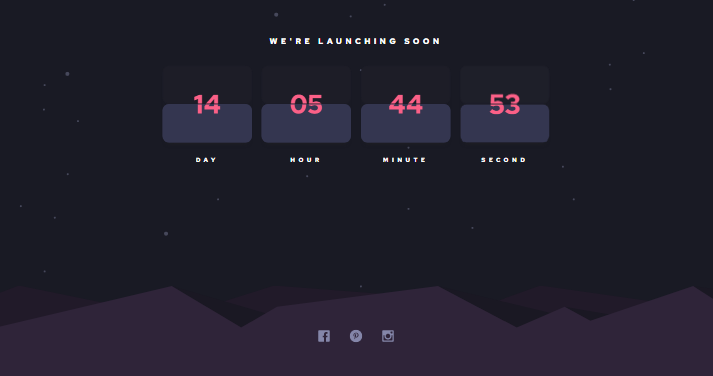

# Frontend Mentor - Launch countdown timer solution

## Table of contents

- [Overview](#overview)
  - [Screenshot](#screenshot)
  - [Links](#links)
- [My process](#my-process)
  - [Built with](#built-with)
  - [What I learned](#what-i-learned)
  - [Continued development](#continued-development)
- [Author](#author)

## Overview

### Screenshot



### Links

- Solution URL: [Add solution URL here](https://your-solution-url.com)
- Live Site URL: [Add live site URL here](https://your-live-site-url.com)

## My process

### Built with

- React
- SCSS
- Flexbox
- CSS Grid
- Laptop-first workflow

### What I learned

I learnt how to create a timer with react and also make the flip animation with react and css animations.

```scss
.timeBox {
  display: flex;
  flex-direction: column;

  p {
    margin: 2rem 0rem;
    color: $color-white;
    text-align: center;
    font-weight: 100;
    letter-spacing: 0.5rem;
    animation: moveUp 500ms ease-in;
  }
}

@keyframes moveUp {
  0% {
    opacity: 0;
    transform: translateY(2rem);
  }

  100% {
    opacity: 1;
    transform: translateY(0);
  }
}
```

```react
 const [timeLeft, setTimeLeft] = useState({
    day: 0,
    daysShuffle: true,
    hour: 0,
    hoursShuffle: true,
    minute: 0,
    minutesShuffle: true,
    second: 0,
    secondsShuffle: true,
  });
  const calculateTimeLeft = () => {
    totalSeconds = Math.trunc((new Date("04.18.2022") - new Date()) / 1000);

    const timeLeftNow = {
      day: String(Math.trunc(totalSeconds / (60 * 60 * 24))).padStart(2, 0),
      hour: String(Math.trunc((totalSeconds / (60 * 60)) % 24)).padStart(2, 0),
      minute: String(Math.trunc((totalSeconds / 60) % 60)).padStart(2, 0),
      second: String(Math.trunc(totalSeconds % 60)).padStart(2, 0),
    };

    if (timeLeft.day !== timeLeftNow.day) {
      setTimeLeft((prevState) => {
        const day = timeLeftNow.day;
        // console.log(timeLeft);
        const daysShuffle = !timeLeft.daysShuffle;
        return {
          ...prevState,
          day,
          daysShuffle,
        };
      });
    }
```

### Continued development

I would love to improve my react skills by learning more about logic, props and states. I would also love to make my sites more animated and alive.

## Author

- Frontend Mentor - [@yourusername](https://www.frontendmentor.io/profile/yourusername)
- Twitter - [@favourejim56](https://www.twitter.com/favourejim56)
